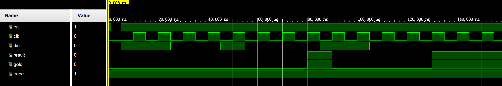

# 实验一

> 董志荣
>
> 21307121

## 实验目标


## 实验方案

### 模组代码

```verilog
`timescale 1ns / 100ps

module detect_3zero(
  input wire bitin,
  input wire clock,
  input wire reset,
  output reg indicator
  );

    reg [1:0] cstate, nstate;
  
    parameter s0=2'b00,
                s1=2'b01,
                s2=2'b10,
                s3=2'b11;
  
    always@(posedge clock or negedge reset) begin
      if(reset == 1'b0)
        cstate<=s0;
      else
        cstate<=nstate;
    end
  
    always@(bitin or cstate) begin
      case(cstate)
        s0:begin
          if(bitin) nstate=s0;
          else nstate=s1;
          indicator=0;
        end
        s1:begin
          if(bitin) nstate=s0;
          else nstate=s2;
          indicator=0;
        end
        s2:begin
          if(bitin) nstate=s0;
          else nstate=s3;
          indicator=0;
        end
        s3:begin
          if(bitin) nstate=s0;
          else nstate=s3;
          indicator=1;
        end
        default:begin
          nstate=s0;
          indicator=0;
        end
      endcase 
    end
endmodule
```

### 测试代码

```verilog
`timescale 1ns / 100ps

module test_d3z();

    reg rst, clk;
    reg din;
    wire result;
    reg gold;
    wire trace;
    
    detect_3zero DUT (.clock(clk), .reset(rst), .bitin(din), .indicator(result));
    
    initial begin
        clk = 1'b0;
        rst = 1'b1;
        din = 1'b0;
        gold = 1'b0;
    end
    
    always begin
        #5 clk = 1'b0;
        #5 clk = 1'b1;
    end
    
    initial begin
        #1 rst = 1'b0;
        #4 rst = 1'b1; din = 1'b1;
        #5 gold = 1'b0;
        #5 din = 1'b1; 
        #5 gold = 1'b0;
        #5 din = 1'b0;
        #5 gold = 1'b0;
        #5 din = 1'b0; 
        #5 gold = 1'b0;
        #5 din = 1'b1;
        #5 gold = 1'b0;
        #5 din = 1'b0;
        #5 gold = 1'b0;
        #5 din = 1'b0;
        #5 gold = 1'b0;
        #5 din = 1'b0; 
        #5 gold = 1'b1;
        #5 din = 1'b1;
        #5 gold = 1'b0; 
        #5 din = 1'b1;
        #5 gold = 1'b0; 
        #5 din = 1'b0;
        #5 gold = 1'b0; 
        #5 din = 1'b0;
        #5 gold = 1'b0; 
        #5 din = 1'b0;
        #5 gold = 1'b1; 
        #5 din = 1'b0;
        #5 gold = 1'b1; 
        #5 din = 1'b0;
        #5 gold = 1'b1;   
        end
        
        assign trace = (result & gold) | (~result & ~gold);
    
endmodule
```

## 实验结果和验证



