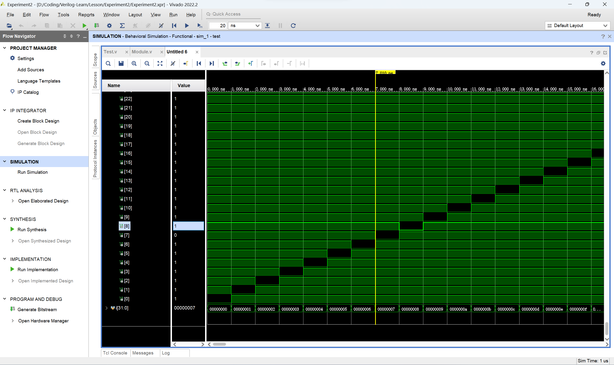

# 实验二

> 董志荣
>
> 21307121

## 实验目标

用Verilog通过门级建模和层次化设计的方法，设计实现2-4译码器，4-16译码器，8-256译码器，最后组合出16-65536译码器，并对其进行仿真测试。

## 实验方案

### 设计思路

使用NAND门和非门构建基础的2-4译码器，然后使用级联的方式构建4-16译码器等电路。

### 模组代码

```verilog
//2-4译码器
module decoder2to4 (
    input wire in0,
    input wire in1,
    input wire E,
    output wire [3:0] Y
);
    
    not n1(nE, E), n2(nin0, in0), n3(nin1, in1);
    nand nd1(Y[3], nE, in0, in1), nd2(Y[2], nE, nin0, in1), nd3(Y[1], nE, in0, nin1), nd4(Y[0], nE, nin0, nin1);

endmodule

//4-16译码器
module decoder4to16(
    input wire [3:0] in,
    input wire E,
    output wire [15:0] Y
);
    
    //选择输出的译码器结果
    wire [3:0] choose;
    decoder2to4 cd(in[2], in[3], E, choose[3:0]);
    //generate块
    genvar i;
    generate
        for (i = 0; i < 4; i = i + 1)
            decoder2to4 d2t4(.in0(in[0]), .in1(in[1]), .E(choose[i]), .Y(Y[i*4+3:i*4]));
    endgenerate

endmodule

//8-256译码器
module decoder_8(
    input wire [7:0] in,
    input wire E,
    output wire [255:0] Y
);
    
    //选择输出的译码器结果
    wire [15:0] choose;
    decoder4to16 cd(in[7:4], E, choose[15:0]);
    //generate块
    genvar i;
    generate
        for (i = 0; i < 16; i = i + 1)
            decoder4to16 d4t16(.in(in[3:0]), .E(choose[i]), .Y(Y[i*16+15:i*16]));
    endgenerate

endmodule

//16-65536译码器
module decoder_16(
    input wire [15:0] in,
    input wire E,
    output wire [65535:0] Y
);
    
    //选择输出的译码器结果
    wire [255:0] choose;
    decoder_8 cd(in[15:8], E, choose[255:0]);
    //generate块
    genvar i;
    generate
        for (i = 0; i < 256; i = i + 1)
            decoder_8 d8t256(.in(in[7:0]), .E(choose[i]), .Y(Y[i*256+255:i*256]));
    endgenerate

endmodule
```

### 测试代码

```verilog
`timescale 1ns/1ps
module  test();
    //初始化输入输出线
    reg E;
    reg [15:0] in;
    wire [65535:0] Y;

    decoder_16 d16(in, E, Y);
    integer i;
    //开始测试
    initial begin
        in = 0;
        E = 0;
        for (i = 0; i < 65536; i = i + 1) begin          
            #1;
            in = in + 1;
        end
    end

endmodule
```

## 实验结果和验证



